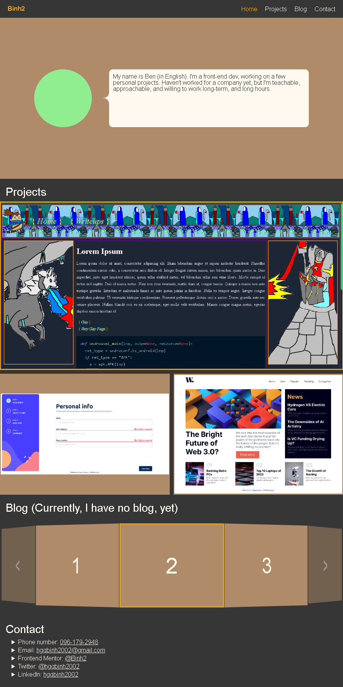
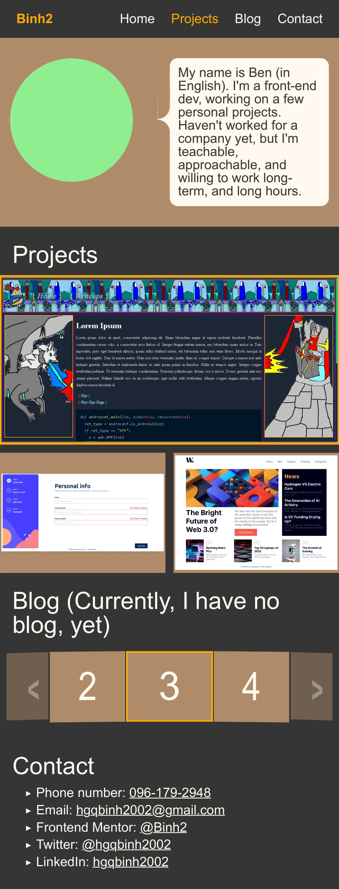

# portfolio - My personal portfolio

## Moltivation

- As a front-end dev, this project is a really good way to practice my skills and learn the creative process of a website.
- Github don't have a way to organize directory so this webpage is way for other people to see my works more easily.

## Table of contents

- [Overview](#overview)
  - [Screenshot](#screenshot)
  - [Links](#links)
- [My process](#my-process)
  - [Built with](#built-with)
  - [What I learned](#what-i-learned)
  - [Continued development](#continued-development)
  - [Useful resources](#useful-resources)
- [Run my source code locally](#run-my-source-code-locally)
- [Author](#author)
- [My recent works](#my-recent-works)
- [Acknowledgments](#acknowledgments)

## Overview

### Screenshot

Desktop screenshot:


Mobile screenshot:


### Links

- Source URL: [See my source code](https://github.com/Binh2/portfolio/)
- Live Site URL: [Visit my live site](https://portfolio-binh2.vercel.app)

## My process

### Built with

- HTML form elements
- CSS custom properties
- CSS Flexbox
- CSS Grid
- Responsive web design
- Vanilla Javascript
- VueJS (Component, Composable, View,...)
- Vue Router

### What I learned

```css
/* Styling scrollbar */
::-webkit-scrollbar {
  width: 6px;
  height: 6px;
  opacity: 0.1;
  transition: 0.5s ease;
  border-radius: 6px;
}
::-webkit-scrollbar-track {
  box-shadow: inset 0 0 6px rgba(0, 0, 0, 0.3);
}
::-webkit-scrollbar-thumb {
  background-color: gray;
  /* outline: 1px solid slategrey; */
  border-radius: 6px;
}
```

```js
// Composable
export function useNewtonianPhysicPosition(acceleration = 0, velocity = 0, position = 0) {
  const _position = ref(position);
  let _velocity = velocity;
  const _acceleration = acceleration;

  function update(intervalInMilisecond: number) {
    _position.value += _velocity * intervalInMilisecond / 1000;
    _velocity += _acceleration * intervalInMilisecond / 1000;
  }

  return { _position, update };
}
```

### Continued development

If I were to continue working on this project, I would try to:

- Make a blog template and add my blogs to it
- Add a form into ContactView
- Make a better footer

### Useful resources

- [VueJS](https://vuejs.org/) - This helped me learn VueJS.
- [Vue Router](https://router.vuejs.org/) - This helped me learn Vue Router.
- [Styling scrollbar](https://css-tricks.com/almanac/properties/s/scrollbar/) - This help me see the bigger picture of styling scroll bar. This webpage doesn't contain much examples which is very unfortunate.

## Run my source code locally

### Clone my project to your local machine
```
git clone https://github.com/Binh2/portfolio.git
```

### Project setup (Download JS dependencies)
```
npm install
```

### Lints and fixes files
```
npm run lint
```

### Compiles and hot-reloads for development
```
npm run serve
```

## How to deploy to my Github Pages (btw, you can't do this without my permission unless you fork my project).

### Compiles and minifies for production (Call npm run deploy will run this command automatically so you don't need to run this command).
```
npm run build
```

## Need more info on customizing Vue CLI configuration
See [Configuration Reference](https://cli.vuejs.org/config/).

## Author

- Frontend Mentor - [@Binh2](https://www.frontendmentor.io/profile/Binh2)
- Twitter - [@hgqbinh2002](https://twitter.com/hgqbinh2002)
- LinkedIn - [hgqbinh2002](https://www.linkedin.com/in/hgqbinh2002/)

## My recent works

### A blog template

- The source code: [Checkout my source code](https://github.com/Binh2/brother-blog)
- Live Site URL: [My live webpage](https://binh2.github.io/brother-blog/)

### Multi-step form

- Solution URL: [My github multi-step-form repo](https://github.com/Binh2/multi-step-form/)
- Live Site URL: [Visit my live site](https://binh2.github.io/multi-step-form/)

### News homepage

- Solution URL: [Check out my solution](https://github.com/Binh2/news-homepage)
- Live Site URL: [My live webpage](https://binh2.github.io/news-homepage/)

## Acknowledgments

- Big thanks to myself for complete this project
